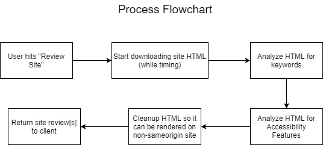
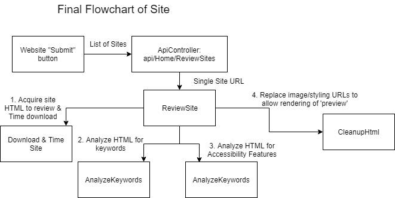

# Site Reviewer

This site demonstrates aggregating, reviewing and displaying other websites.

At present it can review two websites, MoreThan and GoCompare.

## Process

The general flow of the process from request to site review is:

The actual process throughout the site of retrieving and analyzing info is:

## Todo's

### General
Download _all_ references of main page including JavaScript/CSS/Images and timing them.

Refactor results into a form that can be compared.

### Accessibility

Check CSS for media queries and see if it's designed for various screen sizes

Check anchor tags for valid hrefs (if no script will work or not)

### Custom analysis

Check if all files are compressed - if not, how much time could be saved?
